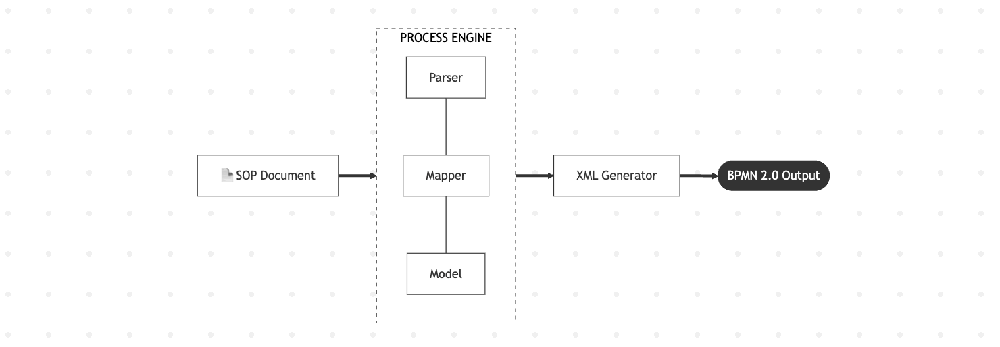
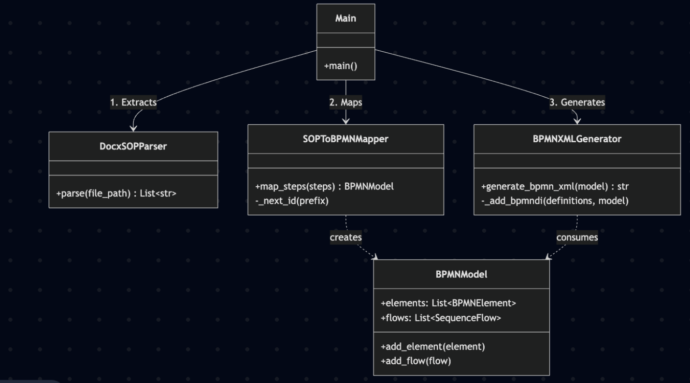
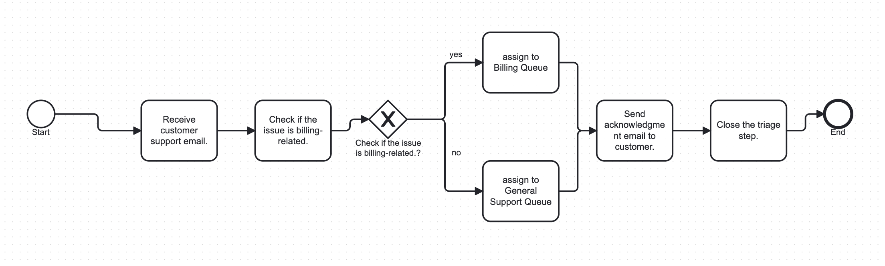
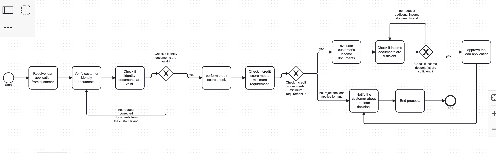

# SOP to BPMN Converter

A Python based tool that transforms Standard Operating Procedure (SOP) documents (.docx) into Business Process Model and Notation (BPMN) 2.0 XML models.

## Approach & Architecture

The system is built on a modular pipeline, the architecture is divided into three distinct, highly testable stages: **Parsing**, **Mapping**, and **Generating**. This ensures that changes to the input format or layout rendering won't require rewriting the core business logic.

#### Visual Flow Diagram

#### Class Diagram

### Components
1. **Parser (`parser.py`)**: Reads the input `.docx` file and extracts meaningful paragraphs as raw text steps.
2. **Mapper (`mapper.py`)**: Analyzes the raw text to identify sequence flows, conditional branches (gateways), and tasks. It builds an internal `BPMNModel`.
3. **Generator (`generator.py`)**: Takes the internal data model and converts it into a standard BPMN 2.0 XML representation, complete with basic auto-layout (BPMNDI) coordinates.

## Key Assumptions

The current implementation makes the following assumptions about the input SOP format:
- **Format**: The input is a valid `.docx` file only.
- **Structure**: Each operational step is represented incrementally, typically separated by paragraphs.
- **Numbering**: Steps are implicitly or explicitly ordered (e.g., prefixing with "1.", "1.1.", etc.).
- **Decisions & Gateways**: 
  - Decision points are framed as questions containing a `?` or the phrase `"check if"`.
  - Conditional branches usually follow a decision point and begin with `"If yes,"` or `"If no,"` mapped to the last seen decision gateway.
  - Complex conditions begin with `"If <condition>,"`.
- **Loops/Jumps**: Backtracking or generic jumps are identified using phrases like `"go to step X"` or `"go back to step X"`.

## Examples

The repository includes two example SOPs to demonstrate the converter's capabilities.

### Example 1: Billing Triage
SOP doc is in examples directory (examples/input_billing.docx)

**Input (`examples/input_billing.docx`) Steps:**
1. Receive customer support email.
2. Check if the issue is billing-related.
3. If yes, assign to Billing Queue.
4. If no, assign to General Support Queue.
5. Send acknowledgment email to customer.
6. Close the triage step.

**Output BPMN (`examples/output_billing.bpmn`):**

xml is can be seen in examples directory (examples/output_billing.bpmn)

### Example 2: Loan Application
SOP doc is in examples directory (input_loan.docx)

**Output BPMN (`examples/output_loan.bpmn`):**

xml is can be seen in examples directory (examples/output_loan.bpmn)

## Next Steps and Improvements

Right now, this handles clean, structured `.docx` files using simple word matching. But real life isn't that clean.

### Handling Messy Inputs
Currently, we expect simple paragraphs. But real SOPs are messy—they come as PDFs, Confluence pages, or even scanned images with tables and nested lists. 
Since the code has a `BaseParser` interface, we can add new parsers without breaking everything else. The immediate goal would be building a preprocessing step that takes messy PDFs or Confluence APIs and flattens them into a clean, standard text format before the mapping even starts.

### Using LLM or NLP for better accuracy
The current `mapper.py` relies on hardcoded checks like `"If yes"` or `"go to step X"`. That's brittle. Real SOPs will be complex and less structured. To fix this, we should replace the regex mapper with a lightweight LLM or an NLP library. We would feed the cleaned text into the model to extract the intent, actors, and decision logic, turning complex human phrasing into our strict `BPMNModel` structure reliably.

### Background Processing: 
Running large documents through an LLM is slow. We'd need to wrap the parser in an API (like FastAPI) and hand the actual work off to a background queue (like Celery/RabbitMQ) so the service stays responsive. 

### Storage:
 We need a real database (like Postgres) to store the original docs, the resulting BPMN XML.

### Better Diagram Layouts:
 We need to improve logic for creating clean diagrams.

